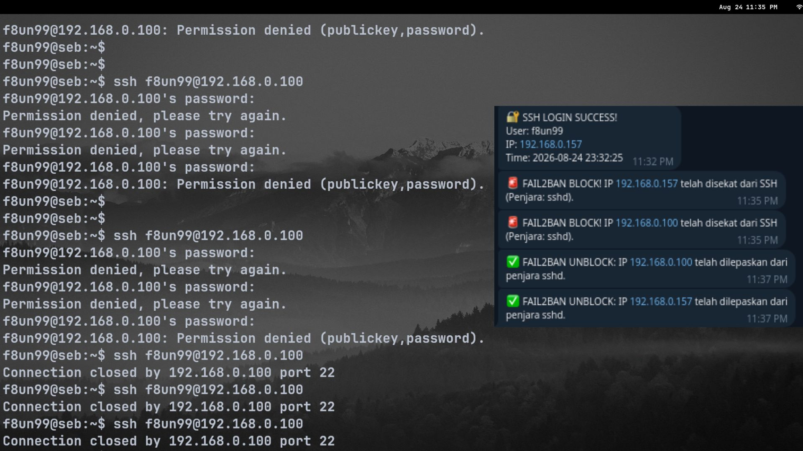

# Seb Centralized Services

## 1. CyberPower UPS Telegram Monitor
	

	 
A lightweight bash script and systemd service to monitor CyberPower UPS status via pwrstat on Linux (Debian) and send real-time alerts to a Telegram bot (Power failure, 50% battery warning, and 20% critical shutdown alert). I built this to solve a recurring issue at home: power trips during thunderstorms. Sudden, unexpected power loss can cause severe long-term damage to server hardware and data integrity. This project ensures I am instantly notified when the power goes out, allowing the server to be monitored and safely shut down before the UPS battery dies.

 **Automated Telegram Alerts:**
  * **Power Outage:** Immediate notification when the server switches to UPS battery power.
  * **Battery at 50%:** Warning when battery capacity drops to half.
  * **Critical Battery (20%):** Emergency alert before the server shuts down.
  * **Power Restored:** Notification when utility power is back and charging.

---

## 2. Fail2Ban & SSH Telegram Sentinel



    A lightweight security monitoring setup for linux (Debian) that sends real-time Telegram alerts for successful SSH logins and automated Fail2Ban IP blocks.
	
	* Scans all active jails (e.g., `sshd`) to retrieve blocked IP addresses.
	* Clean, vertical numbered list display of banned IPs in Telegram.
	* Automatically reports a **"Clean"** status if no IPs are currently blocked.
### Prerequisites

1. **Telegram Bot Setup:** * Create a bot using [@BotFather](https://t.me/BotFather) and copy your **API Token**. * Get your Telegram User ID using [@userinfobot](https://t.me/userinfobot).
2. **UPS Software:** Ensure pwrstat (CyberPower PowerPanel Personal) is installed and properly monitoring your UPS. [https://www.cyberpowersystems.com/product/software/power-panel-personal/powerpanel-personal-linux/](https://www.cyberpowersystems.com/product/software/power-panel-personal/powerpanel-personal-linux/)


---


### Installation

1. Buat fail

```bash
sudo vim /usr/local/bin/seb.sh
```

Code ada dalam Github repo. Replace Token & Chat ID.

2. Jadikan executable

```bash
sudo chmod +x /usr/local/bin/seb.sh
```

3. Jadikan systemd services

```bash
sudo vim /etc/systemd/system/seb.service 
```

Code ada dalam Github repo. 

4. sshrc untuk notify kalau login successful

```bash
sudo vim /etc/ssh/sshrc
```

Code ada dalam Github repo. 

5. Activekan service

```bash
sudo systemctl daemon-reload
sudo systemctl enable seb
sudo systemctl start seb
sudo systemctl status seb
```

5. Change settings untuk PC tak mati cepat (optional). 

By default PC akan mati dalam 60s untuk minimize damage. Change this settings kalau rasa nak panjangkan and since aku ada bot yang akan tunjuk notification status of ups.

```bash
sudo vim /etc/pwrstatd.conf
```

```bash
powerfail-delay = 3600
```

Command ni untuk bagitau server bila UPS dah tinggal n% server akan shutdown. Ambil 20% sebab nak samakan dengan code sebab dia akan notify 50 % and 20%.

```bash
lowbatt-active = yes
lowbatt-threshold = 20
```

7. Save and restart service

```bash
sudo systemctl restart pwrstatd
```
---


### Services

1. Fail2ban

```bash
sudo systemctl restart fail2ban
```

2. Seb (for all features)

```bash
sudo systemctl restart seb.service
```

3. prstatd (ups)

```bash
sudo systemctl restart pwrstatd
```
